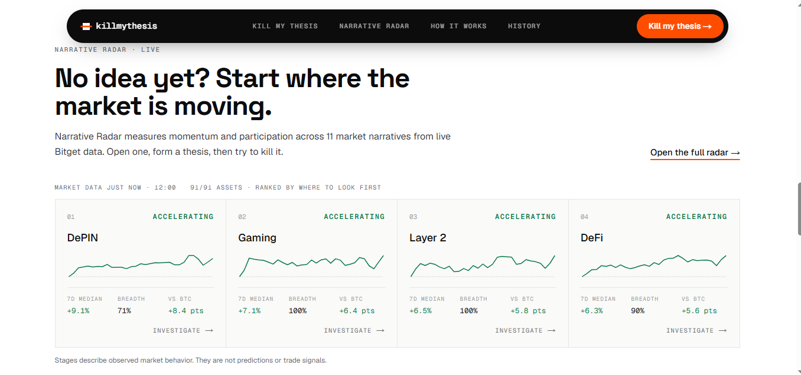
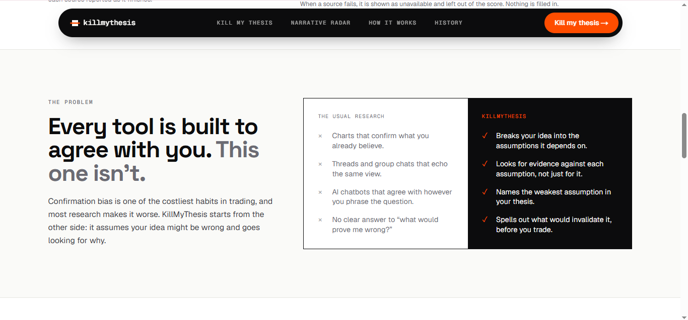

# KillMyThesis

**Bring me your trade idea. I'll try to prove you wrong.**

An AI research desk that stress-tests a market thesis by looking for the evidence against it. You state a trade idea; it breaks the idea into the assumptions it depends on, tests each one against live market data, and reports where the idea is weakest and what would invalidate it.

**Live app:** [killmythesis.vercel.app](https://killmythesis.vercel.app)

Built for the Bitget AI × Crypto Hackathon, Track 3 (AI Trading Desk / AI Research Workbench). It is a research tool, not a trading bot: it never places orders and never asks for exchange keys.



*Narrative Radar: momentum and participation across market narratives, from live Bitget data.*



*The premise: most research confirms what you already believe. This looks for what breaks it.*

## What it does

There are two ways in.

**Kill my thesis** — for when you already have an idea. Write it in plain language, for example *"I'm long SOL because ecosystem activity is getting stronger and this pullback looks temporary."* You get back:

- the assumptions your idea rests on, made explicit
- evidence for and against each one, with the source of every finding
- a research verdict and score from fixed rules
- measurable conditions that would invalidate the thesis

**Narrative Radar** — for when you don't have an idea yet. It measures momentum and participation across 11 market narratives (AI / Compute, DeFi, RWA, Layer 2, Memecoins and others) and ranks where the market is moving. Open a narrative to see why it is classified as it is, then send it straight into KillMyThesis as a thesis.

Together they form one loop: **discover → investigate → form a thesis → test it → decide.**

## How it works

```
Your thesis
  → parsed into a subject, a direction and testable assumptions
  → researched across 7 dimensions, in parallel
  → each finding mapped for or against each assumption
  → scored by fixed rules, producing a verdict
  → a brief: evidence, the weakest assumption, and what would invalidate it
```

The division of labour matters: **the AI reads and explains; code decides.** The model parses your thesis, judges how each finding bears on each assumption, and writes the prose. Every number, score, verdict, narrative stage and invalidation threshold is computed by documented rules in code.

## Data sources

No exchange account or API key is needed for market data; all of these are public endpoints.

| Source | Provides |
|---|---|
| Bitget public market API | Prices, candles, volume, funding rates, open interest, long/short ratios |
| Bitget Signal (MCP) | News headlines and macro indicators |
| alternative.me | Crypto Fear & Greed index |
| DeFiLlama | Chain TVL, DEX volume, stablecoin supply |
| CoinGecko | Total market cap and dominance |

The only credential the app needs is an Anthropic API key, used server-side for the language model.

## Getting started

Requires **Node.js 20 or later**.

```bash
git clone https://github.com/sniperchief/killmythesis.git
cd killmythesis
npm install
cp .env.example .env.local     # then add your ANTHROPIC_API_KEY
npm run dev                    # http://localhost:3000
```

For a production build:

```bash
npm run build
npm start
```

### Configuration

| Variable | Purpose |
|---|---|
| `ANTHROPIC_API_KEY` | Server-only key for thesis parsing, evidence mapping and writing the brief. Never exposed to the browser. |
| `NEXT_PUBLIC_DATA_MODE` | `live` uses real market data (the normal setting). `sample` runs the interface on clearly labelled placeholder data, with no network calls. |

## Testing

```bash
npm test          # unit tests; all network calls are mocked
```

Two optional checks hit real services and make no AI calls:

```powershell
# Live connector smoke test against Bitget and the public data providers
$env:LIVE_CONNECTORS="1"; npx vitest run src/server/research/collectors.live.test.ts --silent=false

# Per-tool diagnosis of the public Bitget Signal MCP server
npm run check:mcp
```

## Project structure

```
src/
  app/                  Pages and the research API route
  components/           Landing page, thesis workspace, brief, radar, shared UI
  lib/
    scoring.ts          The deterministic score and verdict, formula documented in the file
    radar/              Narrative taxonomy and the radar engine
    research/           Client-side research stream and state
  server/
    connectors/         Bitget REST, MCP client, public data providers
    research/           Parser, collectors, evidence mapper, scoring pipeline, brief writer
    radar/              Market data collection, caching, narrative explanations
```

## How the numbers are kept honest

- **A source that fails is reported as unavailable** and left out of the score. Nothing is estimated or filled in.
- **Scores and verdicts come from fixed rules**, not from the model. The same evidence always produces the same result.
- **Invalidation thresholds come from the data** or from a metric's own neutral line, such as zero, 50% or a moving average. The model can only choose among conditions that code has already built.
- **Every finding names its source**, with a link to check it where a public page exists.
- **No trade advice.** The brief never tells you to buy, sell or set a stop. The decision is yours.

## Limitations

- **News and macro coverage is unreliable.** They come from a public MCP server that is frequently unavailable; when it is, those dimensions are shown as unavailable rather than filled in.
- **Research history is stored in your browser only.** There are no accounts, and clearing site data clears your history.
- **Narrative Radar's first load takes several seconds** while it collects market data for about 90 assets. The result is then cached briefly.
- **AI explanations require an API key.** Without one, the calculated metrics still render, and the explanation says it is unavailable.
- **Re-running the same thesis can give a slightly different verdict**, because the model judges each finding fresh on every run. Each brief records the data it used so you can see exactly what it was based on.

## License

[MIT](LICENSE)
